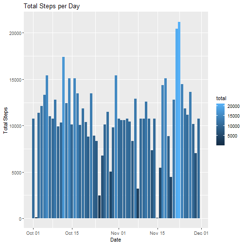
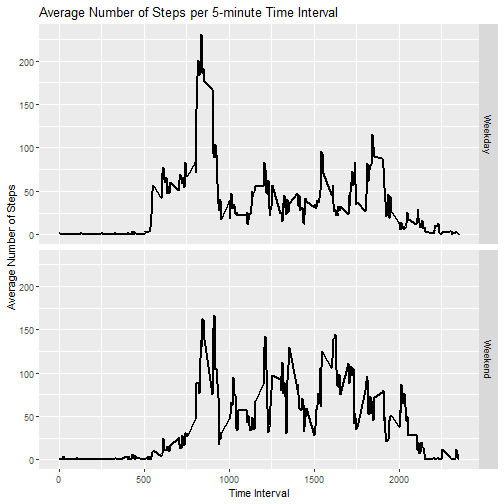

## Loading required packages

``` r
library(stats)
library(dplyr)
library(ggplot2)
```

## Loading and preprocessing the data

### Loading the data into R:

``` r
unzip("activity.zip")
rawdata <- read.csv("activity.csv")
```

### Convert date column into date format, view summary of data:

``` r
rawdata$date <- as.Date(rawdata$date, format = "%Y-%m-%d")
```

### Grouping data by different parameters

``` r
by_date <- group_by(rawdata, date)
date_stats <- summarize(by_date, total = sum(steps, na.rm = T),
                    mean = mean(steps, na.rm = T),
                    median = median(steps, na.rm = T))

by_int <- group_by(rawdata, interval)
int_stats <- summarize(by_int, total = sum(steps, na.rm = T),
                    mean = mean(steps, na.rm = T),
                    median = median(steps, na.rm = T))
```

## What is the mean total number of steps taken per day?

### Histogram of total steps per day

``` r
ggplot(date_stats, aes(date, total)) + 
        geom_bar(stat = "identity", aes(fill = total)) + 
        labs(title = "Total Steps per Day") + 
        xlab(label = "Date") + 
        ylab(label = "Total Steps")
```


### Histogram of mean and median steps per day

``` r
ggplot(date_stats, aes(date, mean)) + 
        geom_bar(stat = "identity", aes(fill = total)) + 
        labs(title = "Average Steps per Day (Mean)") + 
        xlab(label = "Date") + 
        ylab(label = "Average Steps")
```

```
## Warning: Removed 8 rows containing missing values or values outside the scale range (`geom_bar()`).
```


``` r
ggplot(date_stats, aes(date, median)) + 
        geom_bar(stat = "identity", aes(fill = total)) + 
        labs(title = "Average Steps per Day (Median)") + 
        xlab(label = "Date") + 
        ylab(label = "Average Steps")
```

```
## Warning: Removed 8 rows containing missing values or values outside the scale range (`geom_bar()`).
```


### Calculating mean and median of total steps per day

``` r
tot_mean <- round(mean(date_stats$total), digits = 2)
tot_median <- median(date_stats$total)
```
The mean number of total steps per day is 9354.23, and the median is 10395.

## What is the average daily activity pattern?

### Which 5-minute interval, on average across all days, has the maximum amount of steps?

``` r
max_steps <- which.max(int_stats$mean)
max_interval <- int_stats[max_steps,]
```
The 5-minute interval with the maximum amount of steps, on average, is 835.

### Time series of average number of steps throughout the day

``` r
ggplot(int_stats, aes(interval,mean)) + 
        geom_line(linewidth = 1) +
        xlab(label = "Time Interval") +
        ylab(label = "Average Number of Steps") +
        labs(title = "Average Number of Steps per 5-minute Time Interval")
```


## Imputing Missing Values

### Calculating the total number of missing values

``` r
na_values <- sum(as.integer(is.na(rawdata$steps)))
```
There are 'r na_values' missing values.  
Let's use the average of each time interval to replace the missing values.

### Creating a new data set that replaces NA values of original data set

``` r
filled_data <- rawdata
filled_data$steps <- ifelse(is.na(filled_data$steps),
                            yes = int_stats$mean[int_stats$interval %in% filled_data$interval],
                            no = filled_data$steps)
```

### Generating a histogram of total number of steps per day

``` r
imp_by_date <- group_by(filled_data, date)
imputed_stats <- summarize(imp_by_date, total = sum(steps),
                    mean = mean(steps),
                    median = median(steps))
ggplot(imputed_stats, aes(date, total)) + 
        geom_bar(stat = "identity", aes(fill = total)) + 
        labs(title = "Total Steps per Day") + 
        xlab(label = "Date") + 
        ylab(label = "Total Steps")
```



### Calculating mean and median total steps per day, with imputed data

``` r
tot_mean_imp <- round(mean(imputed_stats$total), digits = 2)
tot_median_imp <- round(median(imputed_stats$total), digits = 2)
```
The mean number of total steps per day is 10766.19, and the median is 10766.19. These values differ from the initial estimates, and the effect of imputing the data for the NA values has made the mean and median the same.

## Differences in activity patterns between weekdays and weekends

### Adding factor column to filled data

``` r
filled_data$day_type <- ifelse(weekdays(filled_data$date) %in% c("Saturday", "Sunday"),
                               yes = "Weekend",
                               no = "Weekday")
filled_data$day_type <- as.factor(filled_data$day_type)
```

### Creating panel plot of average steps per 5-minute interval

``` r
by_int_imp <- group_by(filled_data, interval, day_type)
int_stats_imp <- summarize(by_int_imp, total = sum(steps),
                    mean = mean(steps),
                    median = median(steps),
                    day_type = day_type)
```

```
## Warning: Returning more (or less) than 1 row per `summarise()` group was deprecated in dplyr 1.1.0.
## ℹ Please use `reframe()` instead.
## ℹ When switching from `summarise()` to `reframe()`, remember that `reframe()` always returns an ungrouped data frame
##   and adjust accordingly.
## Call `lifecycle::last_lifecycle_warnings()` to see where this warning was generated.
```

```
## `summarise()` has grouped output by 'interval', 'day_type'. You can override using the `.groups` argument.
```

``` r
ggplot(int_stats_imp, aes(interval,mean)) + 
        facet_grid(day_type~.) +
        geom_line(linewidth = 1) +
        xlab(label = "Time Interval") +
        ylab(label = "Average Number of Steps") +
        labs(title = "Average Number of Steps per 5-minute Time Interval")
```



During weekdays, the majority of steps taken are in the earlier part of the day, while the distribution of steps during weekends are more spread out during the day. Steps also begin earlier in the day overall on weekdays compared to weekends.
